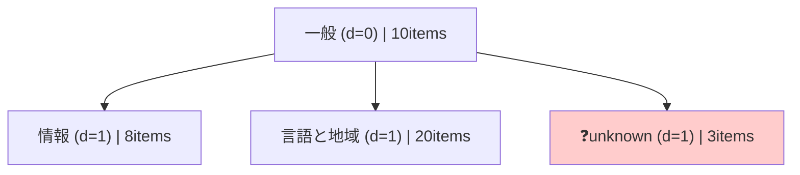

# LudusCartographer

**AI にモバイルアプリを自律探索させ、すべての画面を「地図」として記録・検索できるシステム。**

Appium + PaddleOCR + OpenCV テンプレートマッチングによるハイブリッド UI 検出で、
テキストのないグラフィカルボタン（× 閉じる・☰ メニュー・← 戻る）も自動認識。
発見した画面は MySQL に保存され、PHP ベースの Web 管理画面からリアルタイムに検索できる。

```
iPhone / Android (実機 or Simulator)
        ↓  Appium 2.x (XCUITest / UiAutomator2)
  Python クローラー  crawler/
    ├── PaddleOCR 3.4.0  — テキスト要素を抽出
    ├── OpenCV matchTemplate — アイコン・画像ボタンを検出
    ├── DFS エンジン — 画面遷移を再帰探索
    └── MySQL — 画面・遷移データを保存
        ↓
  PHP 8.x + Twig  web/
    ├── 全文検索・詳細検索 API
    ├── セッション統計パネル
    └── 画面接続マップ（A → B）
```

---

## システムの強み

| 特徴 | 詳細 |
|------|------|
| **ハイブリッド検出** | OCR（文字）と OpenCV テンプレートマッチング（画像）を組み合わせ。テキストのないアイコンも見落とさない |
| **座標依存ゼロ** | タイトル抽出・タップ候補抽出ともに相対比率で算出。任意の解像度・デバイスに対応 |
| **phash 静止検知** | タップ後の固定待機を廃止。DCT phash ハミング距離でアダプティブに「画面が静止したか」を判定 |
| **バックトラッキング検出** | `_crawl_impl()` の戻り値で「遷移が起きたか」を厳密に判定し、誤った `back()` 呼び出しを防止 |
| **ADR による設計管理** | 全アーキテクチャ決定を `docs/adr/` に記録。却下案・根拠・実測データを含む |
| **DB 未接続でも動作** | MySQL 未設定時はサンプルデータにフォールバック。ゼロ設定で Web UI を確認可能 |

---

## ディレクトリ構成

```
LudusCartographer/
├── crawler/
│   ├── lc/                        # メインパッケージ
│   │   ├── crawler.py             # DFS クローラー本体
│   │   ├── driver.py              # AppiumDriver ラッパー + wait_until_stable()
│   │   ├── ocr.py                 # PaddleOCR ラッパー
│   │   ├── capabilities.py        # iOS/Android Capabilities ビルダー
│   │   └── utils.py               # UDID 自動検出・phash 計算
│   ├── tools/
│   │   └── visualize_map.py       # 遷移マップ可視化 (Mermaid/ASCII/Gap分析)
│   ├── assets/templates/          # テンプレートマッチング用アイコン PNG
│   ├── evidence/                  # クロール証拠ファイル (before/after/OCR結果)
│   ├── tests/                     # Pytest テストスイート (Appium 不要テストあり)
│   ├── main.py                    # クローラー エントリポイント
│   └── requirements.txt
├── web/
│   ├── public/
│   │   ├── index.php              # 検索 UI メイン
│   │   ├── api/search.php         # JSON API (search / detail / get_sessions)
│   │   └── img.php                # 証拠画像セキュアプロキシ
│   ├── src/ScreenRepository.php   # MySQL クエリ + FULLTEXT 検索
│   └── templates/search.html.twig
├── tests/e2e/search.spec.ts       # Playwright E2E テスト (35/35)
├── docs/
│   ├── adr/001-universal-ui-detection.md   # アーキテクチャ決定記録 (Phase 1-8)
│   └── schema/database.sql        # MySQL スキーマ
└── CLAUDE.md                      # 開発運用憲法
```

---

## セットアップ

### 1. 前提ツール（macOS）

```bash
# Node.js v18 LTS (Appium 2.x は v21 に非対応)
brew install nodebrew
nodebrew install v18.20.8 && nodebrew use v18.20.8
echo 'export PATH="$HOME/.nodebrew/current/bin:$PATH"' >> ~/.zshrc && source ~/.zshrc

# Appium 2.x + iOS/Android ドライバー
npm install -g appium
appium driver install xcuitest     # iOS
appium driver install uiautomator2 # Android

# iOS 実機ツール（iOS Simulator のみなら不要）
brew install libimobiledevice ideviceinstaller ios-deploy
```

### 2. Python 環境

```bash
cd crawler
python3 -m venv venv
venv/bin/pip install -r requirements.txt
```

> **初回の PaddleOCR モデルダウンロードに数分かかります。**
> ダウンロード後は `~/.paddlex/` にキャッシュされます。

### 3. 環境変数

```bash
cp crawler/config/.env.example crawler/config/.env
# .env を編集: IOS_BUNDLE_ID を設定
```

主要な環境変数:

| 変数 | 必須 | 説明 |
|------|------|------|
| `IOS_BUNDLE_ID` | ✅ | ターゲットアプリの Bundle ID (例: `com.apple.Preferences`) |
| `DEVICE_MODE` | — | `"SIMULATOR"` (デフォルト) または `"MIRROR"` |
| `IOS_USE_SIMULATOR` | — | `"1"` で iOS Simulator モード |
| `IOS_SIMULATOR_UDID` | — | シミュレータ UDID (省略時: 自動選択) |
| `IOS_UDID` | — | 実機 UDID (省略時: 自動検出) |
| `CRAWL_DURATION_SEC` | — | クロール時間上限 (デフォルト: `180`) |
| `CRAWL_MAX_DEPTH` | — | DFS 最大深さ (デフォルト: `3`) |
| `DB_HOST` | — | MySQL ホスト (省略時: DB 保存スキップ) |
| `MIRROR_WINDOW_TITLE` | — | UxPlay ウィンドウ検索タイトル (デフォルト: 自動検索) |
| `MIRROR_DEVICE_WIDTH` | — | デバイス論理幅 pt (デフォルト: `393` — iPhone 16) |
| `MIRROR_DEVICE_HEIGHT` | — | デバイス論理高さ pt (デフォルト: `852` — iPhone 16) |

### 4. MySQL スキーマ（任意）

```bash
mysql -u root -p < docs/schema/database.sql
```

---

## 実行方法

### Appium サーバーの起動

```bash
# 別ターミナルで起動（クロール中は常駐させる）
PATH="$HOME/.nodebrew/current/bin:$PATH" appium --port 4723
```

### クローラーの実行

```bash
cd crawler

# ── iOS Simulator — アプリ名を指定 ───────────────────────────────
IOS_USE_SIMULATOR=1 IOS_BUNDLE_ID=com.apple.Preferences \
  venv/bin/python main.py "iOS設定"

# ── iOS Simulator — アプリ名省略 → TestRun_YYYYMMDD_HHMM で自動命名
IOS_USE_SIMULATOR=1 IOS_BUNDLE_ID=com.apple.Preferences \
  venv/bin/python main.py

# ── iOS Simulator — 探索パラメータ指定 (-d は --duration の短縮形)
IOS_USE_SIMULATOR=1 IOS_BUNDLE_ID=com.apple.Preferences \
  venv/bin/python main.py "iOS設定" -d 600 --depth 4

# ── 実機ミラーリング (UxPlay) — アプリ名あり ─────────────────────
# UxPlay と Appium を起動してから実行する（--mirror がセットアップガイドを表示）
venv/bin/python main.py --mirror \
  --bundle com.example.mygame \
  "MyGame" -d 300 --depth 4

# ── 実機ミラーリング — アプリ名省略 → MirrorRun_YYYYMMDD_HHMM で自動命名
venv/bin/python main.py --mirror --bundle com.example.mygame

# ── 実機ミラーリング（環境変数でも指定可能） ────────────────────
DEVICE_MODE=MIRROR IOS_BUNDLE_ID=com.example.mygame \
  venv/bin/python main.py "MyGame"

# ── iOS 実機 Appium（UDID 自動検出） ─────────────────────────────
IOS_BUNDLE_ID=com.example.mygame venv/bin/python main.py "MyGame"

# ── Android（ADB 経由でデバイス自動検出） ────────────────────────
ANDROID_BUNDLE_ID=com.example.mygame venv/bin/python main.py
```

#### ゲーム名の自動命名ルール

`APP_NAME` 位置引数を省略した場合、以下の優先順位で `game_title` が決まります:

| 優先順位 | 条件 | 命名結果 |
|---------|------|---------|
| 1 | `APP_NAME` 位置引数を指定 | 指定値をそのまま使用 |
| 2 | `--title` オプションを指定 | 指定値をそのまま使用 |
| 3 | `GAME_TITLE` 環境変数が設定済み | 環境変数の値を使用 |
| 4 | `IOS_BUNDLE_ID` 環境変数が設定済み | Bundle ID をそのまま使用 |
| 5 | 何も設定なし・Simulator モード | `TestRun_YYYYMMDD_HHMM` |
| 6 | 何も設定なし・Mirror モード | `MirrorRun_YYYYMMDD_HHMM` |

#### ミラーリングモード (`--mirror`) の前提条件

| ステップ | 内容 |
|----------|------|
| 1. UxPlay 起動 | `brew install uxplay && uxplay` — iPhone の映像を Mac に表示 |
| 2. 画面ミラーリング | iPhone「コントロールセンター」→「画面ミラーリング」→ UxPlay を選択 |
| 3. Appium 起動 | `PATH="$HOME/.nodebrew/current/bin:$PATH" appium --port 4723` |
| 4. ネットワーク | iPhone と Mac を同じ Wi-Fi に接続 (USB 接続も可) |

> **ウィンドウが見つからない場合**: `MIRROR_WINDOW_TITLE=UxPlay` を環境変数に設定してください。

#### CLI 引数一覧

| 引数 | 説明 |
|------|------|
| `APP_NAME` | アプリ/ゲーム名（位置引数・省略可）。省略時は自動命名 |
| `--mirror` | ミラーリングモードで起動 (`DEVICE_MODE=MIRROR` / `IOS_USE_SIMULATOR=0` を自動設定) |
| `--bundle BUNDLE_ID` | Bundle ID を直接指定 (`IOS_BUNDLE_ID` より優先) |
| `--title GAME_TITLE` | ゲームタイトルを直接指定（後方互換用。`APP_NAME` 位置引数が優先） |
| `--duration SEC`, `-d SEC` | クロール最大時間（秒）デフォルト: 300 (5分) |
| `--depth N` | DFS 最大深さ。デフォルト: 3 |

実行ログの見方:

```
[CRAWL] ✅ 新規画面 #1  深さ=0  title='一般'  items=10件  指紋=8f1a6277…
[CRAWL]  → [1/10] タップ: '情報'  pixel=(259,1143)
[CRAWL]  ← 戻る完了: '情報'
[CRAWL]  🔄 [NO_NAV] 非遷移タップ: 'ああ' — back() スキップ   ← 遷移なしを正しく検出
[ICON]  検出: 'close_btn'  score=0.923  pos=(1050,80)          ← テンプレートマッチング
```

### Web 管理画面へのアクセス

```bash
cd web
php -S localhost:8080 -t public/
```

ブラウザで `http://localhost:8080` を開く。

| 機能 | URL |
|------|-----|
| 画面検索 | `http://localhost:8080/` |
| 詳細検索 API | `http://localhost:8080/api/search.php?action=search&keyword=ショップ` |
| セッション一覧 API | `http://localhost:8080/api/search.php?action=get_sessions` |
| 画面詳細 API | `http://localhost:8080/api/search.php?action=detail&id=1` |

> **DB 未接続時**: サンプルデータが表示されます。MySQL なしでもすべての機能を確認できます。

---

## 遷移マップの可視化

```bash
cd crawler

# 最新セッションのマップを全形式で出力
venv/bin/python tools/visualize_map.py --format all

# Mermaid 形式（Mermaid Live Editor で貼り付け可能）
venv/bin/python tools/visualize_map.py --format mermaid

# ASCII ツリー
venv/bin/python tools/visualize_map.py --format tree

# 要調査画面のレポート (unknown / タップ候補少 など)
venv/bin/python tools/visualize_map.py --format gaps
```

Mermaid 出力例:



---

## アイコンテンプレートの追加

`crawler/assets/templates/` に PNG を置くと、クローラー起動時に自動読み込みされ
テンプレートマッチングによるアイコン検出に使用される。

```
ファイル名（拡張子なし）= 検出結果の text フィールド (icon: プレフィックス付き)

例:
  close_btn.png  →  text: "icon:close_btn"
  menu_btn.png   →  text: "icon:menu_btn"
```

信頼度閾値（デフォルト `0.80`）は `CrawlerConfig(icon_threshold=0.80)` で調整可能。

---

## テスト

```bash
# Appium・実機不要のユニットテスト
cd crawler
PADDLE_PDX_DISABLE_MODEL_SOURCE_CHECK=True \
  venv/bin/python -m pytest tests/ -v --ignore=tests/test_crawler.py

# 統合テスト（Appium + iOS Simulator 必要）
IOS_USE_SIMULATOR=1 IOS_BUNDLE_ID=com.apple.Preferences \
  CRAWL_DURATION_SEC=60 \
  venv/bin/python -m pytest tests/test_crawler.py -v -s

# Playwright E2E（Web UI）
npx playwright test --reporter=line
```

### テスト状況

| テストファイル | 件数 | 条件 |
|---------------|------|------|
| `test_capabilities.py` | 34 passed | Appium 不要 |
| `test_utils.py` | 20 passed | Appium 不要 |
| `test_ocr.py` | 10 passed | Appium 不要（実画像を使用） |
| `test_icon_detection.py` | 13 passed | Appium 不要（合成画像） |
| `test_visualize_map.py` | 10 passed | Appium 不要 |
| `test_ai_analyzer.py` | 27 passed | Appium 不要（モック） |
| `test_db_conn.py` | 8 passed, 3 skipped | MySQL 起動時のみ |
| `test_crawler.py` | 13 passed | Appium + iOS Simulator 必要 |
| Playwright E2E | 35 passed | PHP サーバー自動起動 |

---

## 環境情報

| ツール | バージョン | 備考 |
|--------|-----------|------|
| Python | 3.9.6 | `crawler/venv/` |
| PHP | 8.2.x | Web UI |
| Node.js | **18.x LTS** | Appium 2.x に必要。v21 は非対応 |
| Appium | 2.19.0 | |
| xcuitest driver | 8.4.3 | iOS（macOS 専用） |
| uiautomator2 driver | 3.10.0 | Android |
| PaddleOCR | 3.4.0 | `predict()` API を使用 |
| OpenCV | 4.10.0 (contrib) | テンプレートマッチング |
| Playwright | 1.41+ | E2E テスト（Chromium） |

---

## アーキテクチャ設計記録 (ADR)

`docs/adr/001-universal-ui-detection.md` に全 Phase の設計決定を記録しています。

| Phase | 内容 |
|-------|------|
| Step 1-2 | タイトル抽出・タップ候補抽出の座標依存排除 |
| Step 3 | phash による Settling Wait（アダプティブ静止検知） |
| Step 4 | スタック時エビデンス自動保存 |
| Step 5 | 数字除去 MD5 指紋 + `{title}@{fingerprint}` キー方式 |
| Phase 6 | Web-Crawl Integration（セッション統計・接続マップ） |
| Phase 7 | ハイブリッド検出（OCR + Template Matching + NMS） |
| Phase 8 | バックトラッキング検出（`_crawl_impl` 戻り値による遷移判定） |

---

## ライセンス

MIT License — Copyright (c) 2026 Isao Shinohara
